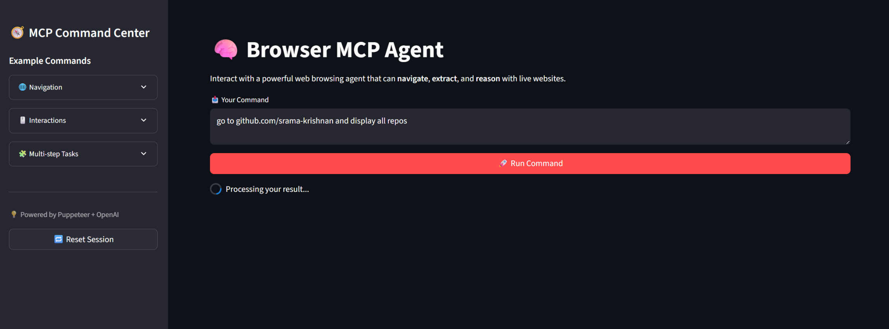
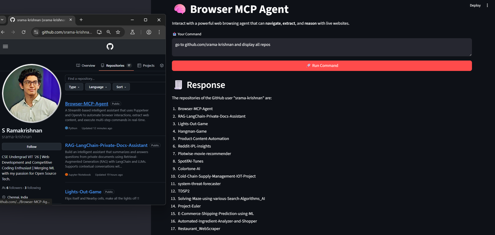

# Web-Powered Agent Using Puppeteer + OpenAI + Streamlit

This project showcases a multi-capable browser automation agent powered by Puppeteer and OpenAI, deployed through a responsive Streamlit interface. It supports tasks like navigating to websites, clicking elements, extracting structured content, summarizing information, and handling complex multi-step actions.




---

## 🚀 Features

- Navigate to any public website and interact like a user
- Extract data such as fonts, text, styles, links, and images
- Perform actions like click, scroll, type, and screenshot
- Intelligent summarization of webpage content using LLM
- Task-based prompt interface for multi-step automation

---

## 🛠️ Technologies

- Python
- Streamlit
- Puppeteer (via internal server)
- OpenAI GPT
- asyncio
- python-dotenv

---

## 📦 Setup

Clone the repository:

``` bash
git clone https://github.com/your-username/browser-mcp-agent.git
```

Navigate into the directory:

``` bash
cd browser-mcp-agent

Install dependencies:

pip install -r requirements.txt
```

Create a `.env` file and add your OpenAI key:

``` bash
OPENAI_API_KEY=your-openai-key-here
```

Run the app:

``` bash
streamlit run main.py
```
---

## 🧪 Example Commands (Use from Sidebar)

- Go to wikipedia.org/wiki/computer_vision
- Click on object detection link
- Scroll down and summarize the page
- Navigate to site and summarize all headings
- Click, extract info, and take screenshot

---

## 💡 About

Built as part of the `mcp_agent` framework, this project demonstrates browser-based intelligence systems that blend reasoning, memory, and task automation. Ideal for prototyping agents capable of browsing and summarizing web data.
